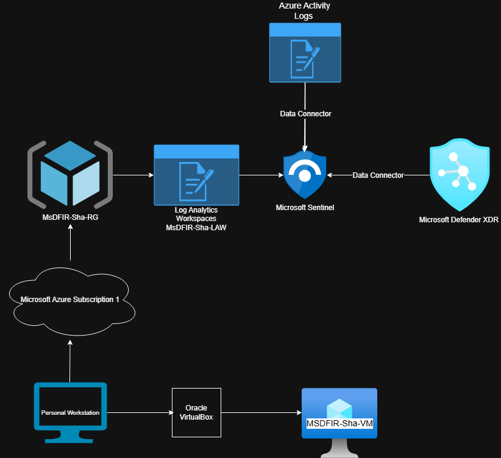

# 🟥🟩 
# 🟦🟨 30-Day Microsoft SOC Analyst Challenge

---

## 📑 Table of Contents

- [Purpose of This Challenge](#-purpose-of-this-challenge)
- [Project Overview](#-project-overview)
- [Repository Structure](#%EF%B8%8F-repository-structure)

---

## 🎯 Purpose of This Challenge

- Learn cybersecurity by doing, not memorizing  
- Build real systems and investigate real behavior  
- Work directly with telemetry, detection logic, and investigations  
- Demonstrate what a modern cloud SOC analyst actually does  
- Share the journey with others interested in cybersecurity  

---

## 📘 Project Overview

This repository documents a 30-day, hands-on Microsoft cloud SOC challenge focused on building, breaking, detecting, and investigating inside a real lab environment.

The purpose of this project is to document real SOC-style work, show how I learn cybersecurity through building and investigation, and share what I learn with others interested in cybersecurity.

This challenge is designed to demonstrate what a modern cloud SOC analyst actually does — working with real systems, real telemetry, and real investigation workflows rather than isolated labs.

Throughout this project, I am focused on:

- Learning by doing, not memorizing  
- Building real environments instead of only following walkthroughs  
- Working directly with telemetry, detection logic, and investigations  
- Intentionally developing SOC-level technical skills  
- Understanding how systems behave and how attacks unfold  

The work in this repository includes building a Microsoft-based SOC lab, onboarding security tooling, validating telemetry, performing threat hunts, analyzing phishing activity, investigating alerts, and producing incident-style reports.

---

## 🏗️ Current Lab Environment

This section represents the current state of the SOC lab used as the foundation for all investigations and mini-projects.

*High-level view of the Microsoft-based SOC lab architecture and how endpoint, identity, and cloud telemetry flow into Sentinel for detection and investigation.*

### 📦 Resources Created So Far

**Cloud:** Azure Subscription, Resource Group (MsDFIR-Sha-RG), Log Analytics Workspace (MsDFIR-Sha-LAW), Azure Activity Logs  
**Security:** Microsoft Defender XDR, Microsoft Sentinel  
**Infrastructure:** Oracle VirtualBox, MSDFIR-Sha-VM

## 🔍 SOC Capability Map

| **🧰 Tools & Platforms** | **🧠 Security Skills Built** | **🏗️ Hands-On Outcomes** |
|:----------------------:|:--------------------------:|:---------------------:|
| Microsoft Azure | SOC lab design & deployment | Microsoft-based cloud SOC lab |
| Oracle VirtualBox | Environment building & validation | On-prem and test VM infrastructure |
| Entra ID | Identity & access investigation | Identity telemetry and sign-in activity analysis |
| Microsoft Sentinel | Log analytics, detection engineering, KQL hunting | Log ingestion, hunting queries, and analytics rules |
| Defender for Endpoint | Endpoint investigation & response | Endpoint telemetry, process, and alert investigations |
| Defender for Office 365 | Phishing and email analysis | Phishing investigations and email telemetry |
| MITRE ATT&CK | Adversary behavior mapping | Techniques mapped to investigations and reports |
| Microsoft Defender XDR | SOC detection & response workflows | Alert investigations and incident-style reports |
| - | Incident reporting & documentation | Incident-style reports and reflections |

---

## 🗂️ Repository Structure

### 🔎 KQL Queries  
➡️ [`/kql-queries`](./kql-queries)  
Threat hunting queries, investigation pivots, detection experiments

---

### 🖼️ Screenshots & Dashboards  
➡️ [`/screenshots-dashboards`](./screenshots-dashboards)  
Dashboards, alerts, timelines, visual evidence

---

### 📧 Phishing Simulations  
➡️ [`/phishing-simulations`](./phishing-simulations)  
Phishing investigations, header analysis, simulation exercises

---

### 📝 Reports & Reflections  
➡️ [`/reports-reflections`](./reports-reflections)  
Incident-style reports, challenge writeups, lessons learned

---

